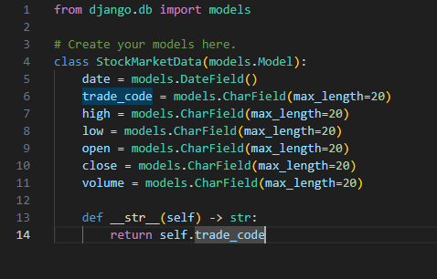
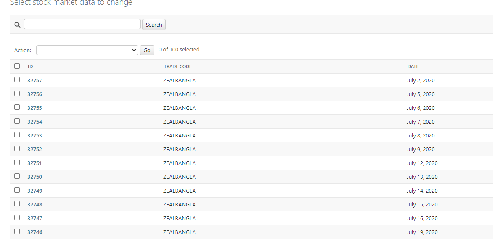
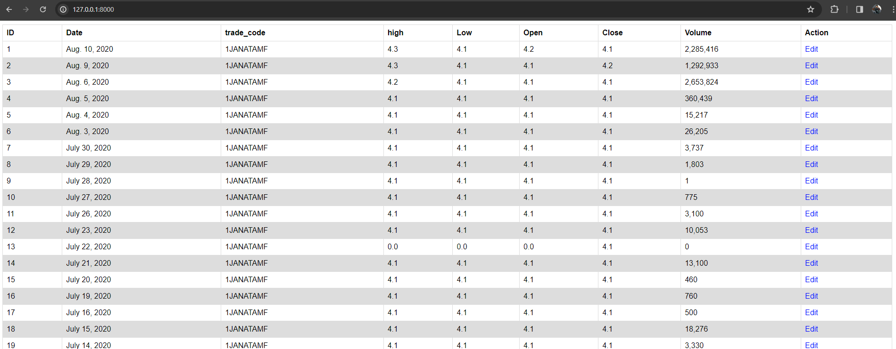
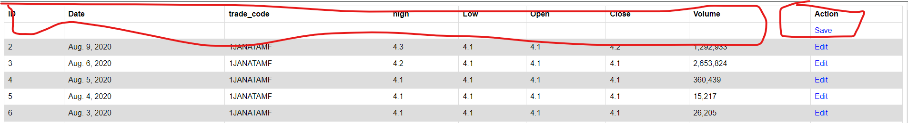

# AI_django_task

Here task is that I have to transfer JSON format database file into SQL format database.

I've share some screenshot sample.

<h4>Screenshot:</h4>

<b>Database Model</b>

<b>Database in Django-admin Panel</b>

<b>Database Table in Website view</b>

<b>Database Table modify in website</b>

<h3>To run the project:</h3> You have to install python if haven't.

## First Create virtual environment:
    python -m venv venv

## Activate the venv:
<h4>Mac</h4>
    source venv/bin/activate

<h4>Windows</h4>
    venv\Scripts\activate

## <h2>Install the packages:</h2>
    pip install -r req.txt

## Default project run code:
    python manage.py runserver ip:port